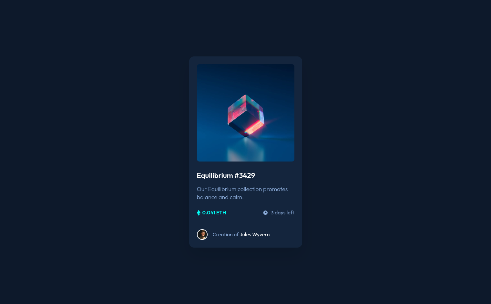
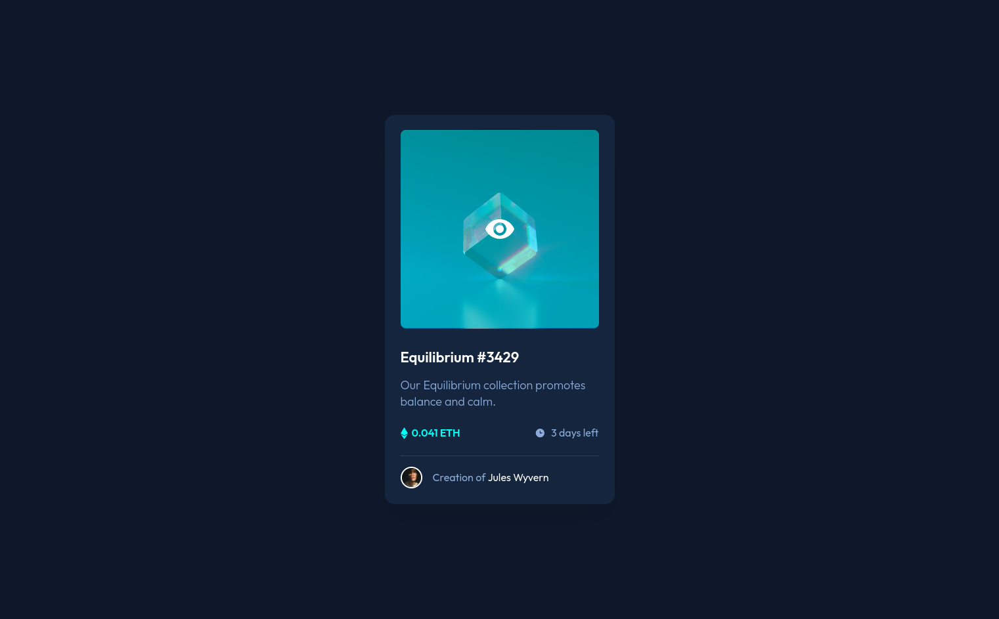
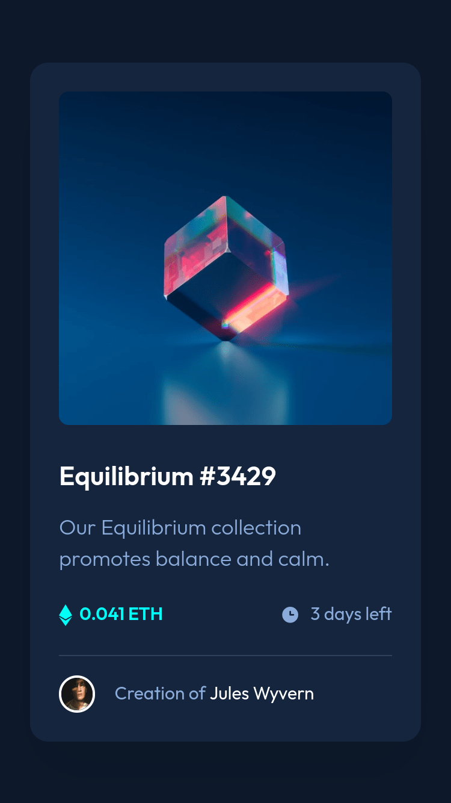

# Frontend Mentor - NFT preview card component solution

This is a solution to the [NFT preview card component challenge on Frontend Mentor](https://www.frontendmentor.io/challenges/nft-preview-card-component-SbdUL_w0U). Frontend Mentor challenges help you improve your coding skills by building realistic projects.

## Table of contents

- [Overview](#overview)
  - [The challenge](#the-challenge)
  - [Screenshot](#screenshot)
  - [Links](#links)
- [My process](#my-process)
  - [Built with](#built-with)
- [Author](#author)
- [Acknowledgments](#acknowledgments)

**Note: Delete this note and update the table of contents based on what sections you keep.**

## Overview

### The challenge

Users should be able to:

- View the optimal layout depending on their device's screen size
- See hover states for interactive elements

### Screenshot

### Links

- Solution URL: [https://www.frontendmentor.io/solutions/a-nice-simple-challenge-using-flexbox-and-absolute-positioning-vV2ow4WBp4](https://www.frontendmentor.io/solutions/a-nice-simple-challenge-using-flexbox-and-absolute-positioning-vV2ow4WBp4)
- Live Site URL: [https://nft-ida.netlify.app/](https://nft-ida.netlify.app/)

## My process

### Built with

- Semantic HTML5 markup
- CSS custom properties
- Flexbox

## Author

- Frontend Mentor - [@mexwebdev21](https://www.frontendmentor.io/profile/mexwebdev21)
- Twitter - [@mexwebdev21](https://www.twitter.com/mexwebdev21)

## Acknowledgments

A big shoutout to Daniel Den - [@denielden](https://www.frontendmentor.io/profile/denielden) for pointing out that I had used the wrong HTML tag.
